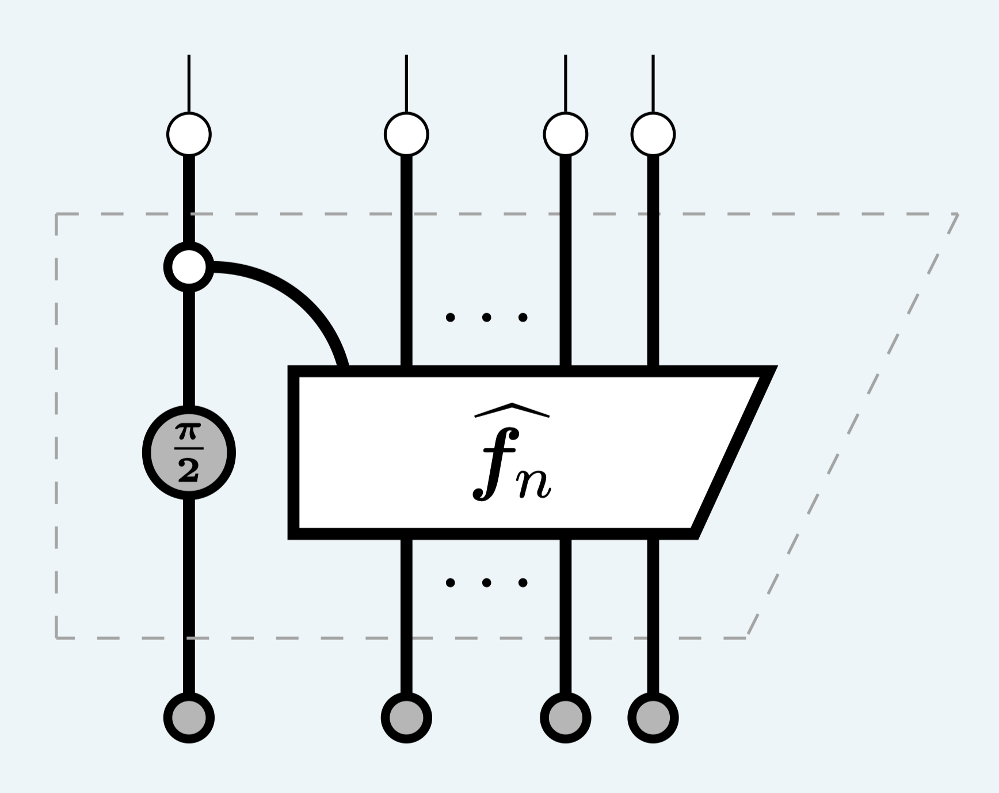

# Fibonacci in the ZX calculus

**ZXFibo:** A simple Fibonacci quantum algorithm based on Clifford+T hardware.



For correctness proof of **ZXFibo** using ZX-calculus, read my August 2024 blog post here: [A benchmark for testing quantum computers with Clifford+T hardware](https://salfaris.github.io/posts/2024-08-04-quantum-fibonacci/).

## Usage

1. Clone this repo.
```bash
git clone https://github.com/salfaris/zxfibonacci
```
2. Install dependencies from requirements: PyZX, Qiskit and matplotlib.
3. Run the hello world script below which compares the result of classical and quantum Fibonacci algorithms:

```python
from zxfibo import zxfibo

def fibo(n):
    """Classical Fibonacci algorithm."""
    if n == 1: return 1
    if n == 2: return 2
    return fibo(n-1) + fibo(n-2)

N = 9
print("Quantum:", end=" ")
for i in range(2, N):
    print(zxfibo(i), end=" ")
print()
print("Classical:", end=" ")
for i in range(2, N):
    print(fibo(i), end=" ")

>>> Quantum: 3 5 8 13 21 34 55 
>>> Classical: 3 5 8 13 21 34 55 
```